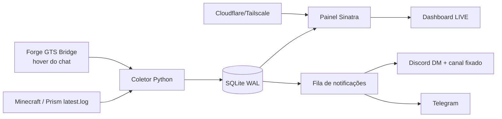

# Pixelmon GTS Signal

[](https://github.com/TopDarkFlames/pixelmon-gts-signal/actions/workflows/test.yml)


> [!IMPORTANT]
> Projeto em desenvolvimento ativo. A arquitetura e o roadmap evoluem a partir do uso real em um servidor Pixelmon.

[Roadmap](ROADMAP.md) · [Changelog](CHANGELOG.md) · [Contribuindo](CONTRIBUTING.md) · [Release atual](docs/RELEASE_v0.4.0.md) · [README de perfil](docs/github-profile-readme.md)

Sistema local que transforma anúncios do GTS Global do Pixelmon em sinais pesquisáveis, alertas privados e histórico de mercado.

Ele acompanha o `latest.log`, enriquece mensagens com dados do hover capturados por um mod Forge próprio e distribui as informações para:

- DM privada no Discord;
- Telegram;
- painel web com histórico, radar de texturas e comparação de preços;
- mensagem oficial no canal do Discord com o endereço atual do painel, pronta para ser fixada.

## Destaques

- Feed do GTS em tempo real com atualização automática.
- Captura enriquecida de hover: IVs, EVs, HA, nature, moves e textura.
- Radar de TXT customizada por Pokémon/item, com histórico agrupado.
- Alertas avançados por item, vendedor, moeda, preço, TXT, IV mínimo e HA.
- Pacote pronto para qualquer TXT de Zacian, Kyogre, Rayquaza, Zamazenta e Eternatus.
- Histórico permanente em SQLite com estatísticas resumidas para meses de dados.
- Bot Discord com presença online, DM privada e mensagem oficial fixada no servidor.
- Telegram, fila persistente, retry automático e painel administrativo.
- Serviço `systemd` que sobe painel, coletor e túnel público quando o PC liga.

## Componentes ativos

| Componente | Tecnologia | Arquivo |
| --- | --- | --- |
| Captura e notificações | Python | `gts_dm_bot.py` |
| Hover completo do chat | Forge 1.12.2 | `gts-bridge/` |
| Sprites e cosméticos locais | Ruby | `lib/gts_assets.rb`, `lib/resource_archive.rb` |
| Painel web | Ruby, Sinatra e ERB | `panel.rb`, `views/` |
| Atualização do feed | HTMX e verificação incremental | `public/dashboard.js`, `public/htmx.min.js` |
| Estilo | CSS | `public/styles.css` |
| Usuários, histórico, alertas e fila | SQLite WAL | `access_panel.db`, `lib/gts_store.rb` |
| Hospedagem automática | Tailscale/Cloudflare | `iniciar_permanente.sh` |
| Inicialização no boot | systemd | `systemd/pixelmon-gts.service` |

## Arquitetura



## Configuração

Requisitos:

- Python 3.10+;
- Ruby 3.4+ e Bundler;
- Linux com `systemd` para o modo automático;
- `cloudflared` e, opcionalmente, Tailscale.

Preparação inicial:

```bash
bundle install
cp .env.example .env
```

As credenciais e caminhos ficam no arquivo `.env`. Use `.env.example` como referência.

Variáveis obrigatórias:

```env
DISCORD_BOT_TOKEN=token_do_bot
DISCORD_USER_ID=id_da_dm
DISCORD_GUILD_ID=id_do_servidor
DISCORD_ANNOUNCE_CHANNEL_ID=id_do_canal
MINECRAFT_LOG_PATH=/caminho/para/minecraft/logs/latest.log
GTS_ASSETS_ENABLED=true

TELEGRAM_ENABLED=true
TELEGRAM_BOT_TOKEN=token_do_botfather
TELEGRAM_CHAT_ID=id_da_conversa

PANEL_HOST=127.0.0.1
PANEL_PORT=8080
PANEL_DB_PATH=access_panel.db
```

Nunca publique o arquivo `.env`.

## Serviço automático

Instalação inicial:

```bash
./instalar_servico_permanente.sh
```

Depois de instalado, painel, bot e túnel iniciam automaticamente com o computador e reiniciam sozinhos em caso de falha.

Não execute outro launcher manual ao mesmo tempo: o serviço automático já usa a porta 8080.

Consultar serviço, URL e logs:

```bash
./status_permanente.sh
```

Comandos de manutenção:

```bash
systemctl --user restart pixelmon-gts.service
systemctl --user stop pixelmon-gts.service
systemctl --user start pixelmon-gts.service
journalctl --user -u pixelmon-gts.service -f
```

## URL pública

O serviço tenta primeiro o Tailscale Funnel, que oferece endereço fixo `*.ts.net`. Se o administrador da tailnet não tiver habilitado Funnel, o sistema usa Cloudflare Quick Tunnel.

No modo Cloudflare, a URL pode mudar após uma reinicialização. O bot atualiza sempre a mesma mensagem no canal do Discord; depois de fixada uma vez, ela permanece fixa enquanto o endereço dentro dela é atualizado.

O permalink dessa mensagem é um endereço fixo e fica salvo em `runtime/permanent_access_url.txt`.

A URL ativa também fica em:

```text
runtime/site_url.txt
```

## Formato detectado

O parser identifica mensagens que contêm `to the global GTS for`, por exemplo:

```text
[GTS Global] grey_xzfx added a Chave de Shiny Aleatório to the global GTS for Token 4.00 Tokens!
```

Tipos reconhecidos:

- PokéCoins;
- Tokens;
- Saldo no Site.

O marcador completo é obrigatório. Mensagens do GTS local ou linhas que apenas mencionem “GTS” são descartadas antes da extração.

Testar uma linha sem enviar notificações:

```bash
python3 gts_dm_bot.py --test-line 'linha completa da log'
```

Testar integrações:

```bash
python3 gts_dm_bot.py --test-discord --test-type token
python3 gts_dm_bot.py --test-telegram --test-type token
```

## Discord

O bot usa `DISCORD_ANNOUNCE_CHANNEL_ID` para criar ou atualizar uma única mensagem oficial com o link do painel. Para fixá-la, o bot precisa destas permissões no canal:

- Ver canal;
- Enviar mensagens;
- Ler histórico de mensagens;
- Gerenciar mensagens.

Os anúncios do GTS continuam sendo enviados para a DM configurada em `DISCORD_USER_ID`.

## Painel

Rotas principais:

- `/login`: autenticação;
- `/register`: solicitação de conta;
- `/dashboard`: histórico ao vivo;
- `/textures`: radar de TXT customizada;
- `/opportunities`: anúncios abaixo da mediana com histórico suficiente;
- `/favorites`: itens e vendedores acompanhados pelo usuário;
- `/seller/:name`: frequência, variedade e histórico do vendedor;
- `/alerts`: monitores personalizados e resultados;
- `/settings`: IDs privados do Discord e Telegram;
- `/listing/:id`: detalhes e histórico de preço;
- `/admin`: usuários, convites e aprovações;
- `/admin/invalid`: revisão dos registros isolados pelo parser;
- `/forgot-password`: recuperação de senha;
- `/health`: verificação do serviço.

O painel oferece tema escuro por padrão com troca opcional para o tema claro, atualização automática por versão, filtros por período e preço, detector de oportunidades, radar de TXT, alertas por usuário, telemetria das integrações e recuperação de senha. Quando os pacotes locais estão disponíveis, ele também resolve sprites comuns e customizados pelo nome, textura e Pokédex, além de imagens de cosméticos identificados pelo NBT. Os arquivos originais não são alterados; somente as imagens usadas são extraídas para o cache ignorado `runtime/listing-assets/`.

A Central de Oportunidades usa até 30 dias de histórico, exige pelo menos três amostras comparáveis e remove valores extremos pelo intervalo interquartil quando existem oito ou mais registros. Cada sinal exibe quantidade de amostras e confiança baixa, média ou alta.

O Radar de Texturas usa a tabela resumida `item_stats`, então a página continua leve mesmo com milhares de anúncios salvos. Cada grupo junta item, TXT e moeda, mantendo primeira aparição, última aparição, mediana, menor preço e maior preço.

Favoritos de itens e vendedores alimentam notificações do navegador. Elas funcionam enquanto o site estiver aberto ou minimizado; avisos com o navegador totalmente fechado exigiriam Web Push com chaves VAPID e um serviço público permanente.

Antes de cada inicialização, o launcher cria um backup consistente do SQLite em `runtime/backups/`. A retenção padrão é de 14 dias e pode ser alterada com `PANEL_BACKUP_RETENTION_DAYS`.

Os anúncios e trabalhos de entrega ficam no SQLite. Falhas de Discord ou Telegram são tentadas novamente até cinco vezes e sobrevivem a reinicializações. O antigo `gts_history.csv` é importado de forma incremental por fingerprint, sem duplicar anúncios já migrados.

## Testes

```bash
./testar.sh
```

Os testes cobrem o parser, moedas, deduplicação, alertas, fila persistente, migração e renderização das rotas Sinatra.

O workflow em `.github/workflows/test.yml` executa a mesma suíte em cada push e pull request.

## GitHub

Para deixar o projeto mais visível no perfil:

- fixe este repositório no perfil;
- use o README pronto em `docs/github-profile-readme.md` no repositório de perfil `TopDarkFlames/TopDarkFlames`;
- crie releases com as notas em `docs/`;
- abra issues usando os templates em `.github/ISSUE_TEMPLATE/`.

## Arquivos importantes

Não apague:

- `.env`;
- `access_panel.db`;
- `gts_history.csv` enquanto a migração não tiver sido confirmada;
- `vendor/`;
- `public/htmx.min.js`;
- arquivos dentro de `views/` e `systemd/`.
